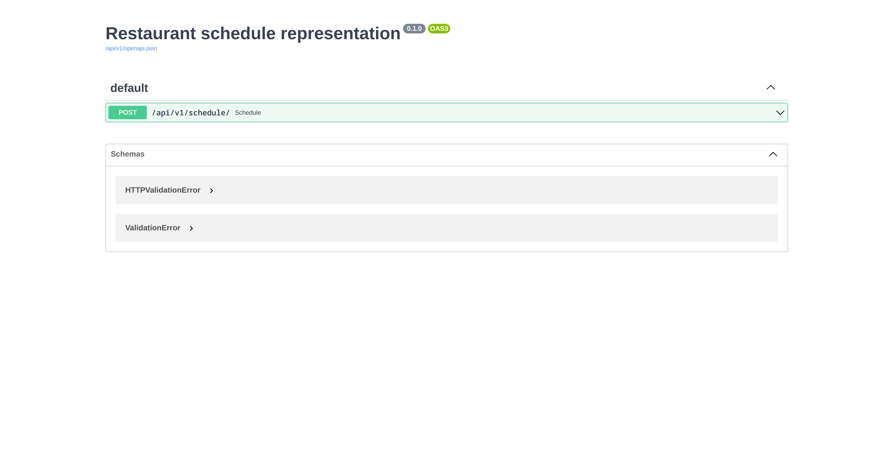

# Restaurant schedule test application

[](https://app.travis-ci.com/DmitryTokyo/fastapi-json-validator)
[](https://opensource.org/licenses/MIT)

## About
Test assignment for procloud company. Transform json restaurant schedule data to readable data. Input data type: json. Output data type: plain text.
The application based on fastapi framework.

## Requirements
- Python 3.10

## Installation
### Full installation and running
1. Clone the repository
2. Create virtual environment `python3 -m venv venv` and activate `source venv/bin/activate`.
3. Install all dependencies `pip install -r requirements/dev.txt`
4. Run the application on the command `make runserver`
5. Open the application on [127.0.0.1:5000/docs/](http://127.0.0.1:5000/docs/)
6. For checking testing results you can run the command `make test` and check a test report

### Use docker
1. Clone the repository
2. In the project directory make following command: `docker compose up` or `docker compose up -d` if you want to launch the app in the background.
3. Open the application on [0.0.0.0:5000/docs/](http://0.0.0.0:5000/docs)

After open the link you should see following page:


## Test data

```json
{
  "friday": [
    {
      "type": "open",
      "value": 64800
    }
  ],
  "saturday": [
    {
      "type": "close",
      "value": 3600
    },
    {
      "type": "open",
      "value": 32400
    },
    {
      "type": "close",
      "value": 39600
    },
    {
      "type": "open",
      "value": 57600
    },
    {
      "type": "close",
      "value": 82800
    }
  ]
}
```

Output result
```text
Friday: 6 PM - 1 AM 
Saturday: 9 AM -11 AM, 4 PM - 11 PM
```
